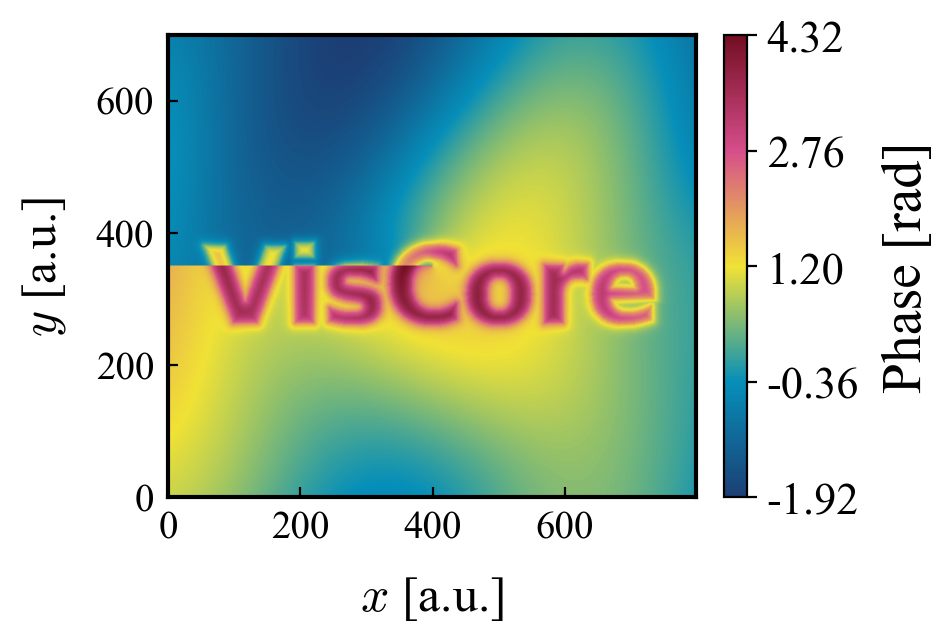
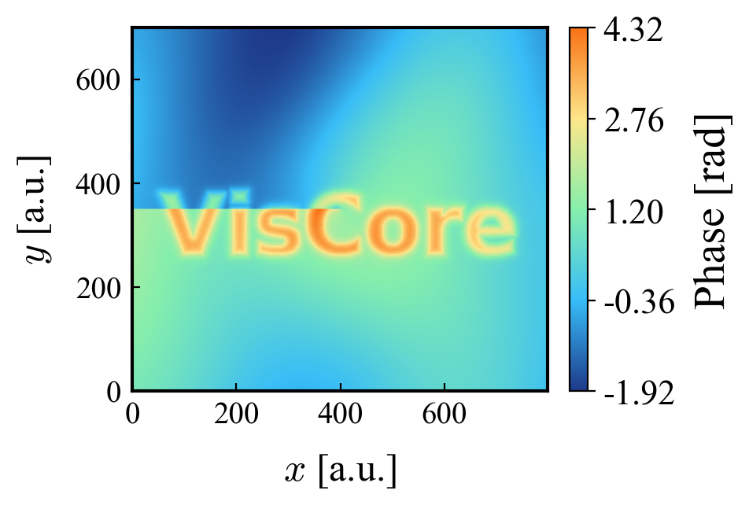
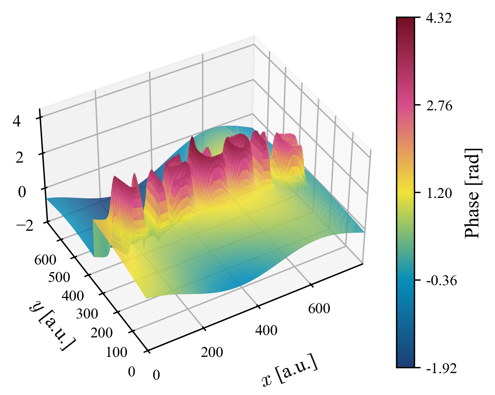
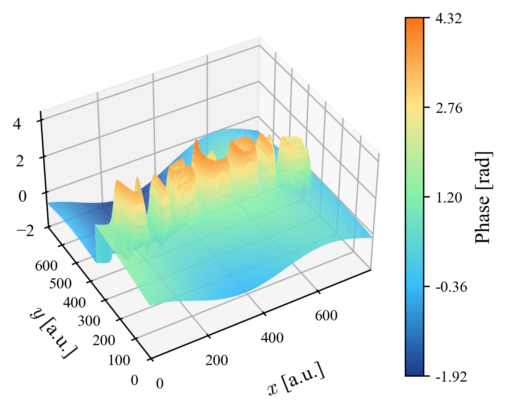
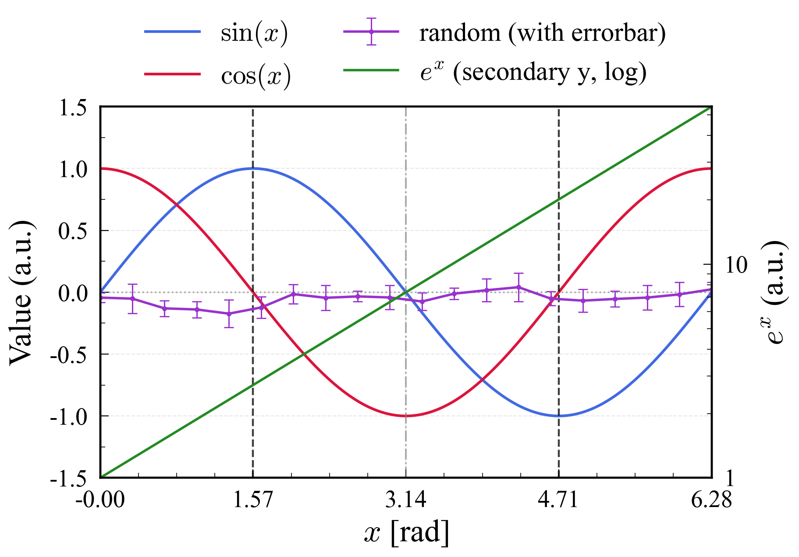
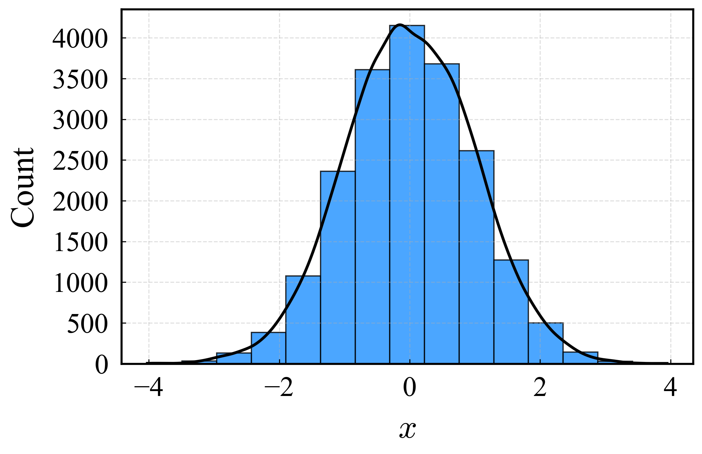
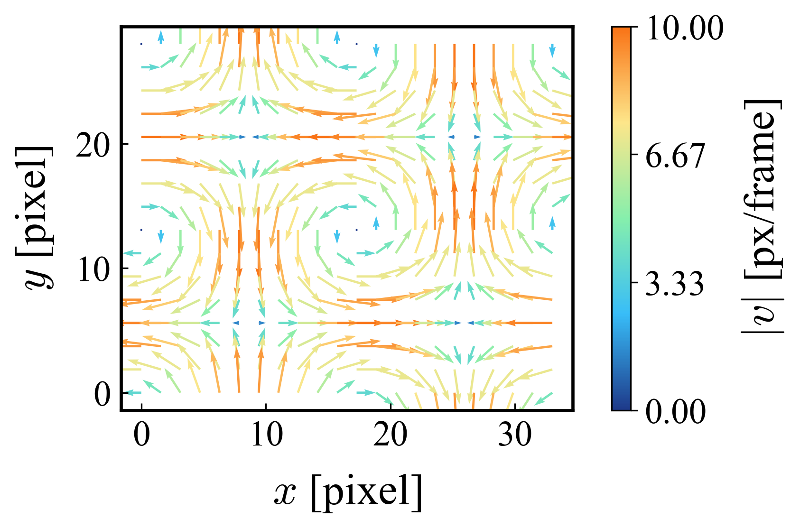
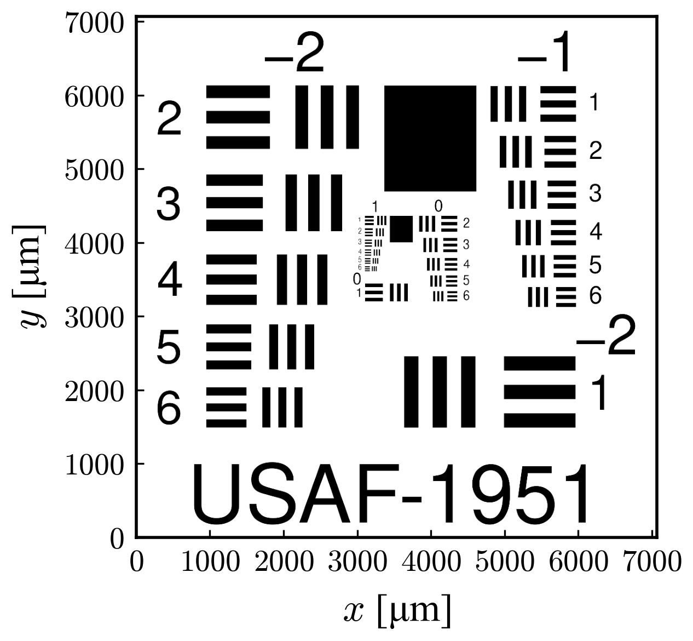

# VisCore – 科学・工学データのための 2D/3D 可視化ツールキット

**VisCore** は、科学・工学・シミュレーション・画像計測向けに、  
**統一スタイルで、論文・発表資料にそのまま使える図**を素早く生成するための軽量 Python 可視化ライブラリです。

- matplotlib ベース（PNG / SVG などで保存）
- 2D ヒートマップ / 3D サーフェス / 折れ線 / ヒストグラム / ベクトル場 / 画像への座標軸付加 を提供
- `import viscore` 時に **フォント設定（Times が環境にある場合）** と **cmthermal 登録**が走ります（副作用あり）

## 目次
- [インストール](#インストール)
- [クイックスタート](#クイックスタート)
- [スタイルとカラーマップ](#スタイルとカラーマップ)
- [関数リファレンス](#関数リファレンス)
  - [create_heatmap_2d（2D ヒートマップ）](#create_heatmap_2d2d-ヒートマップ)
  - [create_plot_3d（3D サーフェス）](#create_plot_3d3d-サーフェス)
  - [create_lineplot_2d（2D 折れ線）](#create_lineplot_2d2d-折れ線)
  - [plot_histogram（ヒストグラム）](#plot_histogramヒストグラム)
  - [create_vector_field_2d（ベクトル場）](#create_vector_field_2dベクトル場)
  - [add_axis_to_image（画像に座標軸）](#add_axis_to_image画像に座標軸)
- [プロジェクト構成](#プロジェクト構成)
- [ライセンス](#ライセンス)
- [作者](#作者)

---

## インストール

（例）このリポジトリ直下で:

```bash
pip install -e .
```

依存（目安）:
- numpy, matplotlib, pandas（heatmap / 3d / lineplot）
- pillow（画像への軸付加）
- scipy, statsmodels（ヒストグラムの KDE / robust binning 用）

---

## クイックスタート

### 1) 2D ヒートマップ（DataFrame: x, y, phase）

```python
import pandas as pd
from viscore import create_heatmap_2d
from viscore.styles.colormaps import cmthermal

df = pd.read_csv("phase_data.dat", sep=r"\s+", names=["x", "y", "phase"])

create_heatmap_2d(
    data=df,
    output_image_path="output_2d.svg",
    x_pixel_pitch=6.9,
    y_pixel_pitch=6.9,
    colormap=cmthermal,
)
```

### 2) 3D サーフェス

```python
import pandas as pd
from viscore import create_plot_3d
from viscore.styles.colormaps import cmthermal

df = pd.read_csv("phase_data.dat", sep=r"\s+", names=["x", "y", "phase"])

create_plot_3d(
    data=df,
    output_image_path="output_3d.png",
    x_pixel_pitch=6.9,
    y_pixel_pitch=6.9,
    colormap=cmthermal,
    view_elev=30,
    view_azim=240,
)
```

---

## スタイルとカラーマップ

### 自動適用（import 時）
`import viscore` により以下が実行されます。

- `setup_fonts()`：Times フォントが見つかれば `matplotlib.rcParams["font.family"]` に設定  
- `register_cmthermal()`：`viscore.cmthermal` として colormap 登録

> 注意: フォントパス/環境によってはフォント設定が効かない場合があります（例外は握りつぶされます）。

### 追加カラーマップ
`viscore/styles/colormaps.py` には以下も定義されています（必要に応じて import して利用）。

- `cmthermal`
- `azure_sunset`
- `aurora`

```python
from viscore.styles.colormaps import aurora, azure_sunset
```

---

## 関数リファレンス

> **共通**  
> 多くの関数は「画像保存」を主目的としており、`output_image_path` を受け取って保存します。  
> 既定では `bbox_inches="tight"` で保存するため、図の周辺余白は小さめになります。

---

## create_heatmap_2d（2D ヒートマップ）

**用途:** `x, y, phase` を持つ DataFrame から 2D ヒートマップを生成し保存します。

**入力**
- `data`: `pandas.DataFrame`（必須列: `x`, `y`, `phase`）
- `x_pixel_pitch`, `y_pixel_pitch`: ピクセルピッチ（例: μm/px）

**よく使うオプション**
- 前処理: `swap_xy`, `invert_y`, `normalize_origin`
- クロップ: `x_min/x_max`, `y_min/y_max`
- カラーバー: `cbar_range` または `z_min/z_max`, `cbar_num_ticks`, `cbar_log`
- 目盛り: `x_tick_interval`, `y_tick_interval`, `*_tick_decimals`
- 軸スケール: `x_log`, `y_log`

**例**
```python
from viscore import create_heatmap_2d
from viscore.styles.colormaps import aurora

create_heatmap_2d(
    data=df,
    output_image_path="heatmap.png",
    x_pixel_pitch=6.9,
    y_pixel_pitch=6.9,
    colormap=aurora,
    cbar_range=(-3.14, 3.14),
    x_tick_interval=200,
    y_tick_interval=200,
)
```

**出力例**  
| 2D Surface | 2D Surface (aurora) |
|---|---|
|  |  |


---

## create_plot_3d（3D サーフェス）

**用途:** `x, y, phase` を持つ DataFrame から 3D サーフェスプロットを生成し保存します。

**入力**
- `data`: `pandas.DataFrame`（必須列: `x`, `y`, `phase`）
- `x_pixel_pitch`, `y_pixel_pitch`: ピクセルピッチ（例: μm/px）

**よく使うオプション**
- 視点: `view_elev`, `view_azim`
- アスペクト: `box_aspect`（完全指定） or `box_aspect_z_scale`
- カラーバー: `cbar_range` または `z_min/z_max`, `cbar_log`
- 解像度: `rcount`, `ccount`（重いときは小さめ推奨）

**例**
```python
from viscore import create_plot_3d
from viscore.styles.colormaps import aurora

create_plot_3d(
    data=df,
    output_image_path="surface.png",
    x_pixel_pitch=6.9,
    y_pixel_pitch=6.9,
    colormap=aurora,
    z_min=-3.14,
    z_max=3.14,
    rcount=150,
    ccount=150,
)
```

**出力例**  
| 3D Surface | 3D Surface (aurora) |
|---|---|
|  |  |

---

## create_lineplot_2d（2D 折れ線）

**用途:** 複数系列（`dict[key -> DataFrame]`）の 2D 折れ線図を生成し保存します。  
secondary y 軸、minor tick、errorbar、凡例制御など “論文向け” の細かい制御に対応します。

**入力**
- `data_dict`: `dict[key -> pandas.DataFrame]`
- `x_col`, `y_col`: 列名
- `output_image_path`: 保存先

**よく使うオプション**
- スタイル: `color_dict/colors/colormap`, `linestyle_dict/linestyles`, `marker_dict/markers`
- 軸: `x_lim`, `y_lim`, `x_scale`, `y_scale`, `x_tick_interval`, `y_tick_interval`
- 凡例: `show_legend`, `legend_outside`, `legend_every`, `legend_max_items`, `legend_formatter`
- 右 y 軸: `use_secondary_y`, `secondary_y_keys`, `secondary_y_lim`, `secondary_y_tick_interval`
- 誤差棒: `use_errorbar`, `yerr_col`, `yerr_low_col`, `yerr_high_col`

**例**
```python
from viscore import create_lineplot_2d

create_lineplot_2d(
    data_dict=data_dict,
    x_col="t",
    y_col="value",
    output_image_path="line.png",
    xlabel="t [s]",
    ylabel="Value",
    grid=True,
    legend_outside=True,
)
```

**出力例**  
| 2D Lineplot (all features) |
|:---:|
| <p align="center"></p> |

---

## plot_histogram（ヒストグラム）

**用途:** 1 次元データのヒストグラム（必要なら KDE 重ね）を VisCore スタイルで描画。  
ビン幅自動（Sturges / FD / Scott / Robust / Shimazaki など）に対応します。`ax=` を渡して overlay も可能です。

**入力**
- `data`: array-like
- `bins`: `"fd" | "sturges" | "scott" | "robust_scott" | "shimazaki" | "sqrt"` など（または bins 配列）
- `kde`: True/False

**例**
```python
import numpy as np
from viscore import plot_histogram

x = np.random.normal(0, 1, 20000)

plot_histogram(
    x,
    bins="sturges",
    kde=True,
    title="Normal(0,1)",
    out_path="hist.png",
)
```

**出力例**  
| Histogram (sturges) |
|:---:|
| <p align="center"></p> |

---

## create_vector_field_2d（ベクトル場）

**用途:** 2D ベクトル場（PIV など）を `quiver` で可視化し保存します。  
色は速度の大きさ `|v|` に基づきます。

**入力**
- `x, y, dx, dy`: 1 次元配列（内部で格子に reshape して描画）
- `x_pixel_pitch`, `y_pixel_pitch`: 座標スケール（任意）

**よく使うオプション**
- 前処理: `swap_xy`, `invert_y`, `normalize_origin`
- 矢印: `arrow_scale`, `arrow_linewidth`, `arrow_width`
- カラーバー: `cbar_range`, `cbar_log`

**例**
```python
from viscore import create_vector_field_2d

create_vector_field_2d(
    x, y, dx, dy,
    output_image_path="vector.png",
    x_pixel_pitch=6.9,
    y_pixel_pitch=6.9,
    colormap="viridis",
    arrow_scale=1.0,
)
```

**出力例**  
| Vector Field |
|:---:|
| <p align="center"></p> |

---

## add_axis_to_image（画像に座標軸）

**用途:** 画像に物理座標軸を付与して保存します。  
明るさ/コントラスト/ガンマ補正や、percentile による表示レンジ指定にも対応します。

**入力**
- `in_img_path`: 画像パス
- `pitch_x`, `pitch_y`: 物理スケール（例: μm/px）
- `output_image_path`: 保存先

**よく使うオプション**
- 画素変換: `brightness`, `contrast`, `gamma`
- 表示レンジ: `use_percentile`, `p_low`, `p_high`
- タイトル: `frame`, `frame_list`, `fps`, `show_time_title`
- 目盛り: `x_tick_interval`, `y_tick_interval`

**例**
```python
from viscore import add_axis_to_image

add_axis_to_image(
    in_img_path="input.png",
    output_image_path="with_axis.png",
    pitch_x=0.1,
    pitch_y=0.1,
    use_percentile=True,
    p_low=1,
    p_high=99,
    gamma=0.8,
)
```

**出力例**  
| Axis on Image |
|:---:|
| <p align="center"></p> |

---

---

## プロジェクト構成

```
viscore/
 ├── viscore/
 │    ├── __init__.py
 │    ├── plotting_2d.py
 │    ├── plotting_3d.py
 │    ├── lineplot_2d.py
 │    ├── histogram.py
 │    ├── plotting_vector_2d.py
 │    ├── plotting_axis_image.py
 │    └── styles/
 │         ├── colormaps.py
 │         └── tex_fonts.py
 └── images/
      ├── 2d/ ...
      ├── 3d/ ...
      └── USAF_1024_axis.png
```

---

## ライセンス

MIT License

---

## 作者

Author: Mitsuki ISHIYAMA
